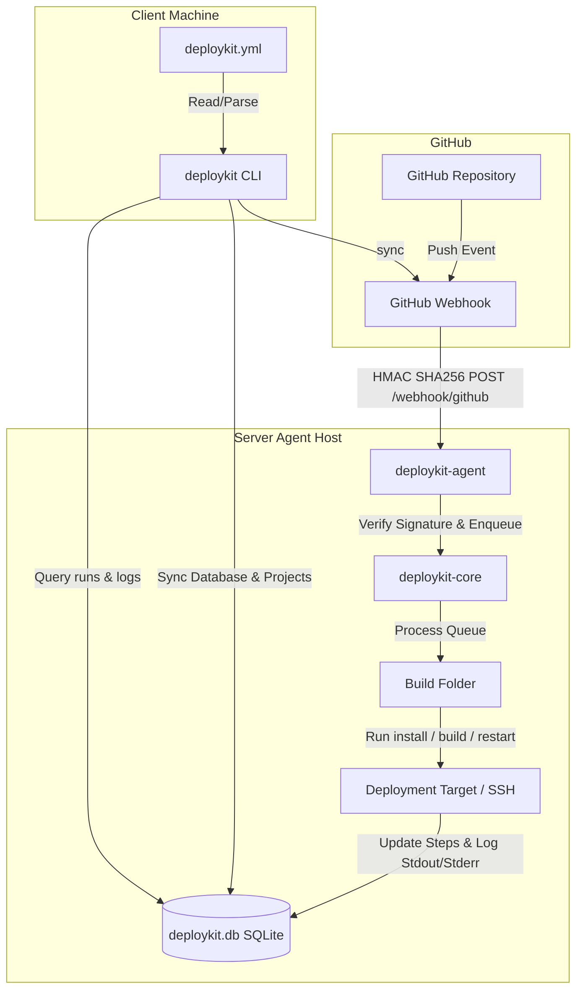

# DeployKit

DeployKit is a lightweight alternative to n8n/Coolify focused only on GitHub-driven deployments. 

Instead of configuring complex CI/CD platforms or UI tools, DeployKit operates on a simple principle: **Add a `deploykit.yml` file, run `deploykit sync`, and DeployKit automatically configures webhooks, deployment targets, and deployment tracking.**

---

## 🏛 General Architecture

DeployKit is designed as a modular **Monorepo** using NPM Workspaces:



---

## 📦 Packages

* **`packages/shared`**: Contains type definitions, schema validations via **Zod**, and YAML config reading/writing helper utilities.
* **`packages/core`**: The heart of the platform. Holds the **SQLite** repository operations, local storage configurations, GitHub webhook manager, execution engine (supporting local and remote SSH commands via **Execa**), and the FIFO deployment queue.
* **`packages/server-agent`**: A standalone HTTP webhook server daemon (Express) that accepts push events from GitHub, verifies payload signatures using timing-safe **HMAC SHA-256**, and triggers core pipelines.
* **`packages/cli`**: The command-line utility built with **Commander.js**, **Inquirer**, and **Ora**, offering an interactive initialization flow, stats tracker, real-time log tailing, and rollback utilities.

---

## 🔒 Webhook Integration & Security

Yes, **Webhook integration is fully supported and active!**

When you run `deploykit sync`:
1. It reads your local `deploykit.yml` file and validates the schema.
2. It prompts you for your Server Agent's public URL if not already configured.
3. It generates a secure, randomized signature secret (`sec_...`) unique to the project.
4. Using the GitHub API via **Octokit**, it automatically registers (or updates) a webhook pointing to your Server Agent (`<agent_url>/webhook/github`) subscribing only to `push` events.
5. It saves the project settings and webhook credentials in the shared SQLite database.

When GitHub fires a webhook:
1. The **Server Agent** receives a `POST` request on `/webhook/github`.
2. It verifies the payload signature header (`x-hub-signature-256`) against the project's secret using safe cryptographic comparisons (`crypto.timingSafeEqual`).
3. If valid, the agent extracts the branch, commit hash, author, and commit message, then schedules the deployment in the FIFO queue database.

---

## 🗄 Database Schema (SQLite)

The local configuration, authorization files, and SQLite database are stored in `~/.deploykit/` (which can be overridden for testing via `DEPLOYKIT_DIR` environment variables).

* **`projects`**: Configured repository detail metadata and webhook secrets.
* **`webhooks`**: GitHub webhook configuration identifiers and endpoints.
* **`deployments`**: Current status (`QUEUED`, `RUNNING`, `SUCCESS`, `FAILED`, `CANCELLED`), commit, and duration metrics.
* **`deployment_steps`**: Timings and status for individual steps (`clone`, `install`, `build`, `restart`).
* **`deployment_logs`**: Full stdout/stderr execution output of each deployment.

---

## 🛠 Commands

* **`deploykit auth github`**: Authenticate using a Browser OAuth Redirect or a Personal Access Token.
* **`deploykit init`**: Detect project type (Node, Docker, Cloudflare, Vercel, PM2) and generate a `deploykit.yml`.
* **`deploykit sync`**: Sync config with the database, generate signature secret, and register GitHub webhook.
* **`deploykit runs`**: List recent deployment runs.
* **`deploykit logs <id> [-f]`**: Print stdout/stderr logs of a run (with real-time tailing via `--follow`).
* **`deploykit stats`**: Check totals, success rate, average times, and quickest/slowest builds.
* **`deploykit rollback <id>`**: Queue a rollback deployment checking out the original commit.
* **`deploykit queue`**: Inspect currently active or queued deployment pipelines.
* **`deploykit cancel <id>`**: Cancel a queued run or terminate an active execa build process.
* **`deploykit project inspect <name>`**: Inspect project details, webhook configurations, and recent run history.

---

## 🧪 Testing & Code Coverage

Isolated tests verify configurations, YAML validations, database repositories, and cascades.

### Run Tests:
```bash
npm test
```

### Check Coverage Report:
```bash
npm run coverage
```

Currently, tests achieve **100% statement and line coverage** on configuration paths and helper systems, and test the major database interactions.
