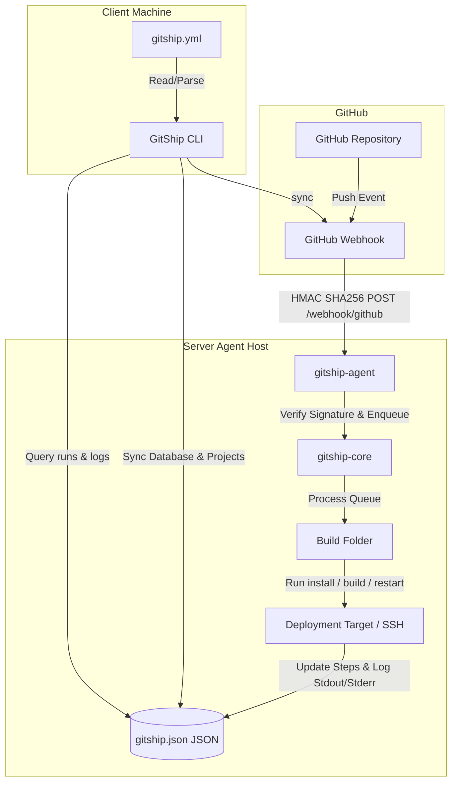

# GitShip

GitShip is a lightweight alternative to n8n/Coolify focused only on GitHub-driven deployments. 

Instead of configuring complex CI/CD platforms or UI tools, GitShip operates on a simple principle: **Add a `gitship.yml` file, run `gitship sync`, and GitShip automatically configures webhooks, deployment targets, and deployment tracking.**

---

## 🛠️ Node Version Management (NVM)

This project targets Node.js **v22**. We use [NVM (Node Version Manager)](https://github.com/nvm-sh/nvm) to easily manage and switch Node versions.

A `.nvmrc` file is provided in the project root. To get started:

1. **Install the correct Node version** (if not already installed):
   ```bash
   nvm install
   ```
2. **Switch to the project's Node version**:
   ```bash
   nvm use
   ```
3. (Optional) Set Node 22 as your shell's default:
   ```bash
   nvm alias default 22
   ```

---

## 🏛 General Architecture

GitShip is designed as a modular **Monorepo** using NPM Workspaces:



---

## 📦 Packages

* **`gitship-shared` (`packages/shared`)**: Contains type definitions, schema validations via **Zod**, and YAML config reading/writing helper utilities.
* **`gitship-core` (`packages/core`)**: The heart of the platform. Holds the **JSON database** repository operations, local storage configurations, GitHub webhook manager, execution engine (supporting local and remote SSH commands via **Execa**), and the FIFO deployment queue.
* **`gitship-agent` (`packages/server-agent`)**: A standalone HTTP webhook server daemon (Express) that accepts push events from GitHub, verifies payload signatures using timing-safe **HMAC SHA-256**, and triggers core pipelines.
* **`gitship-cli` (`packages/cli`)**: The command-line utility built with **Commander.js**, **Inquirer**, and **Ora**, offering an interactive initialization flow, stats tracker, real-time log tailing, and rollback utilities.

---

## 🔒 Webhook Integration & Security

Yes, **Webhook integration is fully supported and active!**

When you run `gitship sync`:
1. It reads your local `gitship.yml` file and validates the schema.
2. It prompts you for your Server Agent's public URL if not already configured.
3. It generates a secure, randomized signature secret (`sec_...`) unique to the project.
4. Using the GitHub API via **Octokit**, it automatically registers (or updates) a webhook pointing to your Server Agent (`<agent_url>/webhook/github`) subscribing only to `push` events.
5. It saves the project settings and webhook credentials in the shared JSON database.

When GitHub fires a webhook:
1. The **Server Agent** receives a `POST` request on `/webhook/github`.
2. It verifies the payload signature header (`x-hub-signature-256`) against the project's secret using safe cryptographic comparisons (`crypto.timingSafeEqual`).
3. If valid, the agent extracts the branch, commit hash, author, and commit message, then schedules the deployment in the FIFO queue database.

---

## 🗄 Database Schema (JSON)

The local configuration, authorization files, and JSON database file (`gitship.json`) are stored in `~/.gitship/` (which can be overridden for testing via `GITSHIP_DIR` environment variables).

* **`projects`**: Configured repository detail metadata and webhook secrets.
* **`webhooks`**: GitHub webhook configuration identifiers and endpoints.
* **`deployments`**: Current status (`QUEUED`, `RUNNING`, `SUCCESS`, `FAILED`, `CANCELLED`), commit, and duration metrics.
* **`deployment_steps`**: Timings and status for individual steps (`clone`, `install`, `build`, `restart`).
* **`deployment_logs`**: Full stdout/stderr execution output of each deployment.

---

## 🛠 Commands

* **`gitship auth github`**: Authenticate using a Browser OAuth Redirect or a Personal Access Token.
* **`gitship init`**: Detect project type (Node, Docker, Cloudflare, Vercel, PM2) and generate a `gitship.yml`.
* **`gitship sync`**: Sync config with the database, generate signature secret, and register GitHub webhook.
* **`gitship check`**: Check if the local config, database registration, and remote GitHub webhook are active and valid.
* **`gitship runs`**: List recent deployment runs.
* **`gitship logs <id> [-f]`**: Print stdout/stderr logs of a run (with real-time tailing via `--follow`).
* **`gitship stats`**: Check totals, success rate, average times, and quickest/slowest builds.
* **`gitship rollback <id>`**: Queue a rollback deployment checking out the original commit.
* **`gitship queue`**: Inspect currently active or queued deployment pipelines.
* **`gitship cancel <id>`**: Cancel a queued run or terminate an active execa build process.
* **`gitship project inspect <name>`**: Inspect project details, webhook configurations, and recent run history.
* **`gitship repos`**: List all repositories in the connected GitHub account.

---

## 🧪 Testing & Code Coverage

Isolated tests verify configurations, YAML validations, database repositories, and cascades.

### Run Tests:
```bash
npm test
```

### Check Coverage Report:
```bash
npm run coverage
```

Currently, tests achieve **100% statement and line coverage** on configuration paths and helper systems, and test the major database interactions.

---

## ☁️ VPS Setup & Production Guide

When deploying GitShip onto a Virtual Private Server (VPS), consider the following guidelines:

### 1. Using IP Addresses vs. Domain Names
- **Server Agent (Webhooks)**: You can use a raw IP address (e.g., `http://192.0.2.1:3000`) for your Server Agent. GitHub webhooks work perfectly with IP addresses.
- **SSL/HTTPS**: If you want secure, encrypted webhooks (using `https://`), you should configure a domain name for your VPS (e.g. `agent.mydomain.com`) and configure an SSL certificate (e.g. via Let's Encrypt / Certbot with Nginx).

### 2. GitHub OAuth Authentication on a VPS
When running `gitship auth github` to authenticate the CLI:
- **On Local Machine**: Standard Browser Redirect OAuth is recommended, using `http://localhost:4567` as the GitHub OAuth App callback.
- **Directly on the VPS (over SSH)**: 
  - **Option A (Personal Access Token)**: Select the **Personal Access Token (Manual)** authentication choice. This is the simplest option when running directly on a remote server as it doesn't require browser redirections.
  - **Option B (SSH Port Forwarding)**: If you still want to use Browser OAuth, you can connect to your VPS with SSH port forwarding:
    ```bash
    ssh -L 4567:localhost:4567 user@your-vps-ip
    Then, running `gitship auth github` on the VPS will forward the authentication code back to your local browser successfully.

### 3. Running the Server Agent in the Background (PM2)
To keep the webhook Server Agent running continuously in the background on your VPS, you can use **PM2**:

- **Option A: Running via the global CLI command**
  If you have installed the CLI globally, you can start the agent directly (default port is 3000):
  ```bash
  pm2 start "gitship agent" --name "gitship-agent"

  # Or running on a custom port (e.g. 8080)
  pm2 start "gitship agent --port 8080" --name "gitship-agent"
  ```

- **Option B: Running the package directly**
  Alternatively, you can run the agent node process directly from the package directory:
  ```bash
  pm2 start packages/server-agent/dist/server.js --name "gitship-agent"

  # Or running on a custom port (e.g. 8080)
  PORT=8080 pm2 start packages/server-agent/dist/server.js --name "gitship-agent"
  ```

To inspect logs, monitor status, or configure PM2 to start on system boot:
```bash
pm2 logs gitship-agent
pm2 status
pm2 startup
pm2 save
```

---

## 🚀 Monorepo Management & Maintenance

### Auditing Dependencies
To run security audits across all workspace packages and their dependencies:
```bash
npm run audit
```

### Version Bumping
To bump the version of all workspace packages at once (e.g. `patch`, `minor`, `major`):
```bash
npm run change patch
```

### Publishing Workspace Packages
To build all packages and publish them to the public npm registry:
```bash
npm run publish
```
